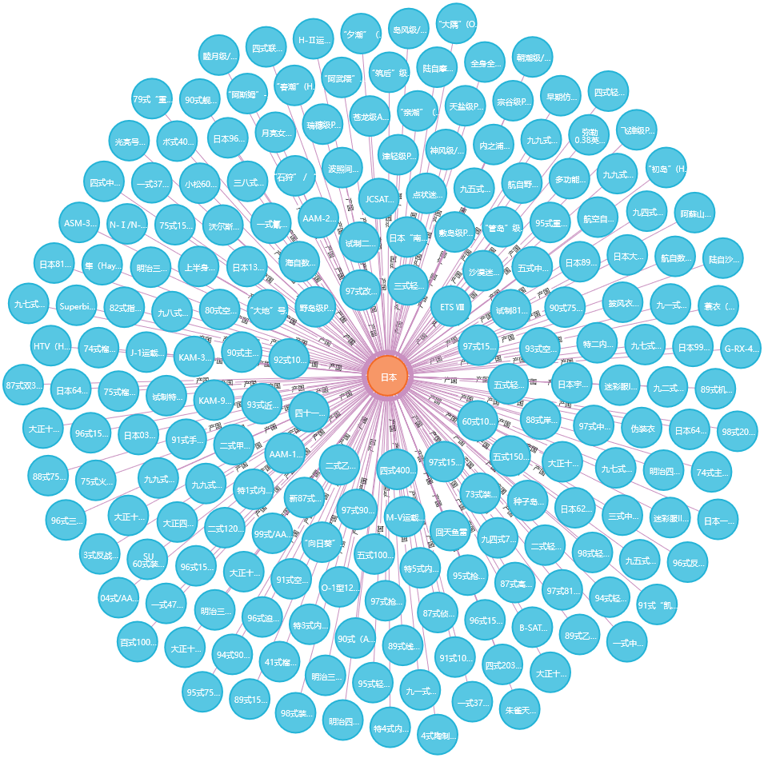
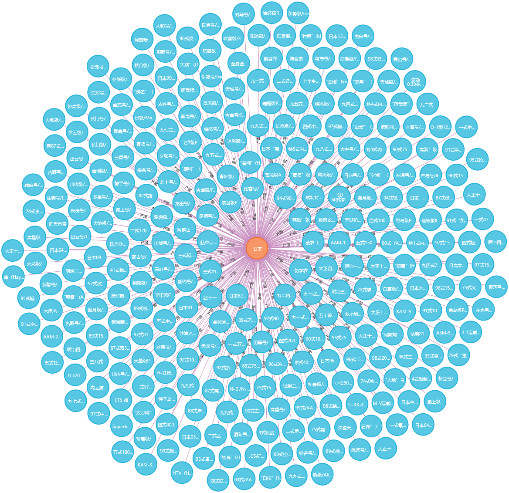

# [MATEKG: A Large-scale Multi-class Equipment Knowledge Graph for Military Auxiliary Tasks (ICISCAE 2023)](https://ieeexplore.ieee.org/document/10393780)
===============================================================================================================

**Displaying 201 nodes, 200 relationships**

**Displaying 300 nodes**

